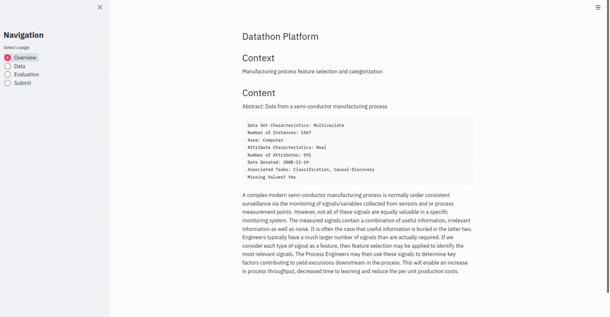

[](https://opensource.org/licenses/MIT)

[Heroku web app](https://minidatathon.herokuapp.com/)



# Mini Datathon

This datathon platform is fully developped in python using *streamlit* in only **115 lines of code**!

As written in the title, it is designed for *small datathon* and the scripts are easy to understand.

## Installation
Clone the repo into your server.

`git clone mini_datathon; cd mini_datathon`

## Usage

You need 5 simple steps to setup your mini hackathon:

1) modify the password of the **admin** user in users.csv
2) add the participants in users.csv
3) modify the `load_target` and `evaluate` function in [main.py](main.py) according to your needs (see [Example](#Example))
4) edit the [templates.py](templates.py) to change the content of the different pages (`markdown` format).
5) run the command `streamlit run main.py`

Please do not forget to notify the participants that the submission file need to be a csv **ordered the same way as given 
in test** and should contain the column `predictions`.

## Example

An example version of the code is deployed on heroku here: [web app](https://minidatathon.herokuapp.com/)

In the current version, the step #3 functions are implemented using the [UCI Secom](https://archive.ics.uci.edu/ml/datasets/SECOM)
imbalanced dataset (binary classification) and evaluated by the [PR-AUC score](https://scikit-learn.org/stable/modules/generated/sklearn.metrics.average_precision_score.html#sklearn.metrics.average_precision_score):
```python 
from sklearn.metrics import average_precision_score

@st.cache
def load_target():
    labels = pd.read_csv('https://archive.ics.uci.edu/ml/machine-learning-databases/secom/secom_labels.data',
                         header=None, sep=' ', names=['target', 'time'])
    y_train = labels.sample(**train_test_sampling)
    y_test = labels.loc[~labels.index.isin(y_train.index), 'target']
    return y_test

def evaluate(y_true, y_pred):
    return average_precision_score(y_true, y_pred, average='micro')

```


## Behind the scenes
### Databases
The platform needs only 2 components to be saved:
#### The leaderboard
The leaderboard is in fact a csv file that is being updated everytime a user submit predictions. 
The csv file contains 2 columns: 
- _id_: the login  of the user
- _score_: the **maximum** score of the user

We will have only 1 row per user since only the maximum score is being saved.

By default, a benchmark score is pushed to the leaderboard:

| id        | score |
|-----------|-------|
| benchmark | 0.6   |

For more details, please refer to the script [leaderboard](leaderboard.py).

#### The users
Like the leaderboard, it is a csv file.
It is supposed to be defined by the admin of the competition.
It contains 2 columns: 
- login
- password

A default user is created at first to begin to play with the platform:

| login     | password |
|-----------|----------|
| admin     | password |

In order to add new participants, simply add rows to the current users.csv file.

For more details, please refer to the script [users](users.py).

## Next steps

- [ ] allow to have a *private* and *public* leaderboard like it is done on kaggle.com
- [ ] store the **encrypted** password in users.csv
- [ ] allow to connect using oauth
- [ ] define user permissions


## License
MIT License [here](LICENSE).

## Credits
We could not find an easy implementation for our yearly internal hackathon at Intel.
The idea originally came from my dear devops coworker [Elhay Efrat](https://github.com/shdowofdeath)
and I took the responsability to develop it.

This version is not the one used at intel.

If you like this project, let me know by buying me a coffee :)
<a href="https://www.buymeacoffee.com/jeremyatia" target="_blank"></a>
